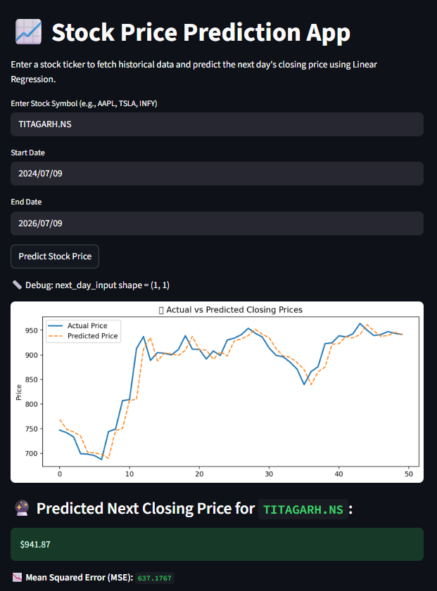

# 📈 Stock Price Prediction App Using Linear Regression

## 📊 Project Overview

This is an interactive web application that allows users to **predict the next day's closing stock price** using historical stock data and **Linear Regression**. The app is built using **Streamlit**, integrated with **Yahoo Finance API (`yfinance`)**, and provides visual insights along with model predictions and error metrics.

---

## 🎯 Objectives

- Fetch historical stock price data from Yahoo Finance.
- Train a **Linear Regression model** to predict next day's closing price.
- Allow users to input custom stock ticker and date range.
- Visualize **Actual vs Predicted prices** using Matplotlib.
- Display **Mean Squared Error (MSE)** and final predicted value.

---

## 📈 Key Features

- 📤 Input: Stock symbol, start and end dates.
- 📊 Visual: Line chart comparing **actual vs predicted** prices.
- 💡 Prediction: Shows the **next day’s predicted closing price**.
- 🧠 Evaluation: Shows **Mean Squared Error (MSE)**.
- ⚡ Built with **Streamlit** for an intuitive and responsive interface.

---

## 🖼️ Dashboard Preview

> The app predicts the next closing price for any Yahoo-listed stock (e.g., `AAPL`, `TSLA`, `TITAGARH.NS`) and compares actual vs predicted prices using a regression line.

---

## 📁 Files Included

- `app.py` – Streamlit app for live stock price prediction  
- `Stock_Price_Prediction_Using_Linear_Regression.ipynb` – Colab notebook for model training and experimentation  
- `output.png` – Screenshot of the app output

---

## ⚙️ Technologies Used

- **Python**
- **Streamlit** – For building the web application
- **yfinance** – To fetch real-time stock data
- **scikit-learn** – Linear Regression
